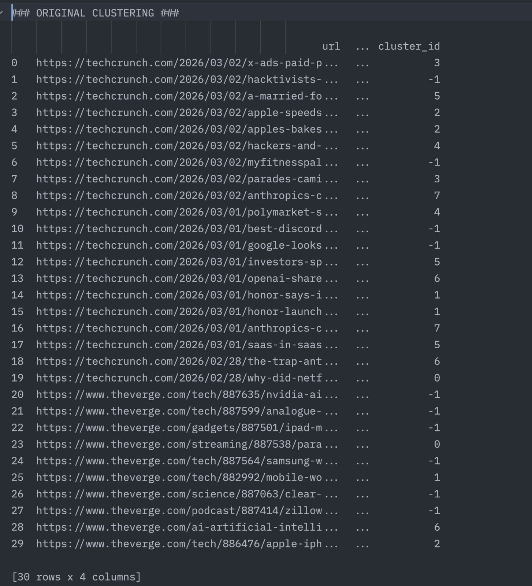
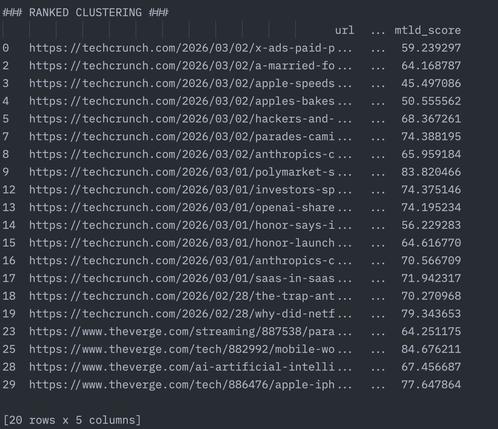
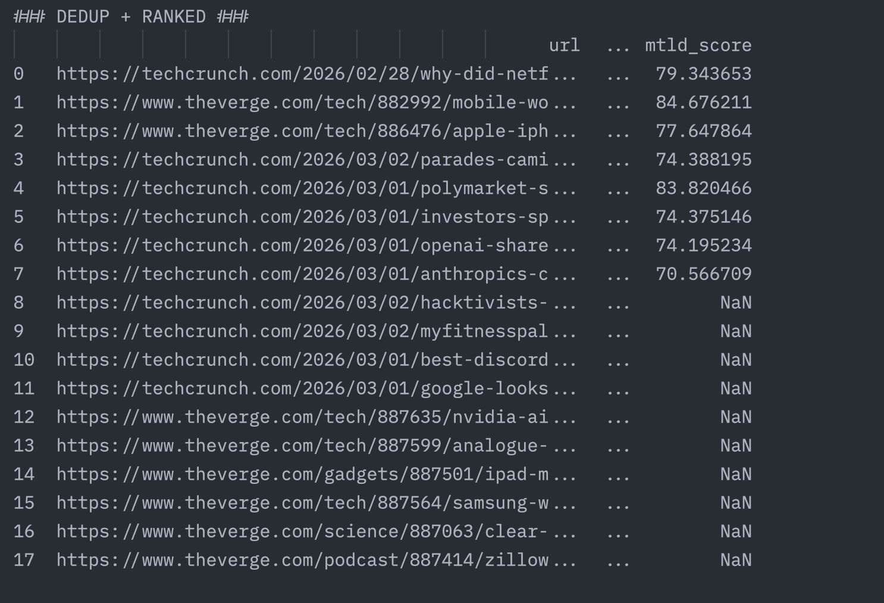

# News Deduplicator & Ranking

A Python pipeline that **scrapes news headlines, removes duplicate stories, clusters related articles, and ranks them** to produce a clean and relevant news feed.

This project is designed for **news aggregation systems** where multiple publishers report the same event. The pipeline identifies duplicate or highly similar headlines and ranks the most important stories.

---

## Features

*  **News Scraping** – Collect headlines from online sources
*  **Duplicate Detection** – Identify similar or repeated stories
*  **Clustering** – Group related news articles together
*  **Ranking System** – Prioritize the most relevant stories
*  **Lightweight Pipeline** – Simple modular Python architecture

---

## Project Structure

```
news-deduplicator-ranking
│
├── scraper.py        # Scrapes news headlines/articles
├── clustering.py     # Clustering algorithm for grouping similar news
├── models.py         # Data models used in the pipeline
├── main.py           # Entry point for running the pipeline
│
├── __init__.py       # Package initialization
│
├── pyproject.toml    # Project dependencies and configuration
├── uv.lock           # Dependency lock file
├── .python-version   # Python version configuration
├── .gitignore
│
├── LICENSE
└── README.md
```

---

## How It Works

The pipeline follows these steps:

1. **Scrape News**
   * `scraper.py` collects headlines,text and url from news sources. 
2. **Preprocess Data**
   * texts are cleaned and normalized.
3. **Cluster Similar Articles**
   * groups related stories using similarity measures.
4. **Rank Articles**
   * The remaining unique stories are ranked based on relevance or scoring logic.
5. **Deduplicate News**
   * Duplicate or near-duplicate headlines are removed.
   
---

## Installation

Clone the repository:

```bash
git clone https://github.com/mundano17/news-deduplicator-ranking.git
cd news-deduplicator-ranking
```

Install dependencies:

```bash
uv sync
```
---

## Usage

Run the pipeline:

```bash
uv run main.py > output.txt
```

This will:

* Scrape news headlines
* Cluster related stories
* Remove duplicates
* Rank the final set of articles

---

## Example Output

1. Original News
   
2. Ranked News (not including the unique stories)
   
3. Ranked + Deduplicated (has the unique stories as well)
   

---

## Technologies Used

* Python
* Text similarity algorithms
* Clustering techniques
* Web scraping

---

## Future Improvements

* Add clustering and ranking based on headlines
* Support better rss source validation
* Add **real-time streaming pipeline**
* Improve ranking using **ML models**

---

## License

This project is licensed under the **MIT License**.

---

## Author

**mundano17**

GitHub:
[https://github.com/mundano17](https://github.com/mundano17)
